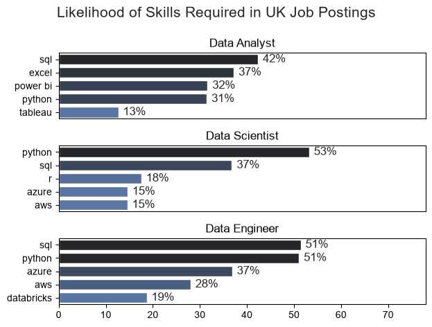
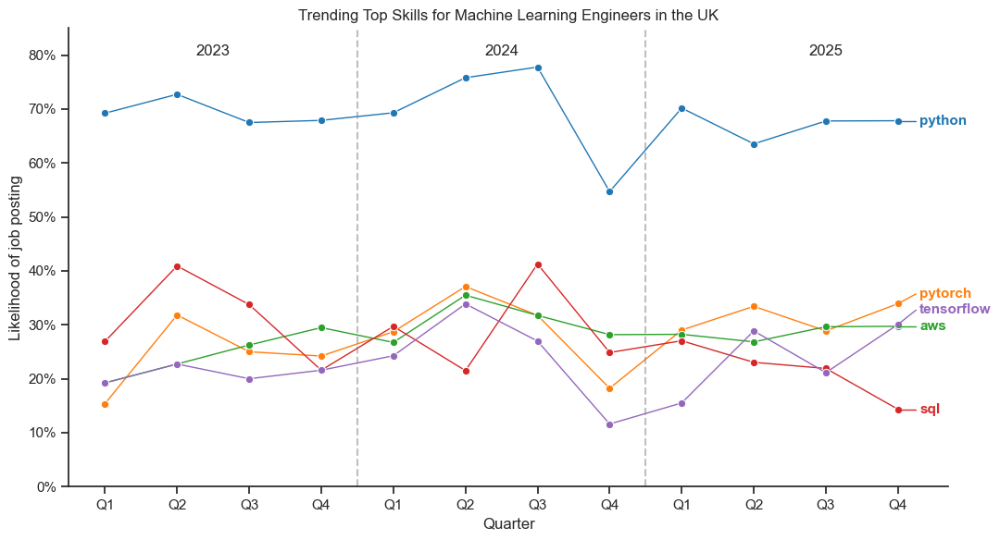

# The Analysis

## 1. What are the most in demand skills for the jobs we are looking at?

I chose to filter the top 5 most in demand skills for each of my three positions. It is worth noting that Machine Learning Engineers had significantly less postings than the other 2 positions, likely due to it being a relatively new position in most companies.

View my notebook with the detailed steps on this here: [Skills_count.ipynb](Project/Skills_count.ipynb)

### Results

### Insights

- Python is extremely in demand for Data Scientists and , especially, Machine Learning Engineers, featuring in 53% and 67% of postings respectively. While not as prevalent, it still features in just under a third of postings for Data Analysts.

- SQL features in the top 3 most wanted skills for all 3 jobs and is the most in demand skill for Data Analysts, although this is quite closely followed by Excel, Power BI and Python.

- Each job role is more likely to require skills based on: 
    - Visualisation and cleaning of data - Power BI, Tableau (Data Analysts)
    - Cloud Technology - AWS, Azure (Data Scientists)
    - Machine Learning libraries - Pytorch, Tensorflow (Machine Learning Engineers)

## 2. How are in-demand skills trending for our jobs?

To find how these skills were trending, I filtered my data into 3 separate dataframes for my 3 separate job roles and plotted this data on a quarterly basis from the start of 2023 to
the end of 2025.

View my notebook with the detailed steps on this here: [skills_distribution.ipynb](Project/skills_distribution.ipynb)

## 2.1 Data Analysts

- Apart from Tableau, the four most requested skills all declined in demand from Q2 2024 until Q1 2025, before rising sharply to a peak in Q3 2025. 

- SQL is consistently the most in-demand skill for UK Data Analysts, appearing in the highest proportion of job postings in every quarter analysed.

- Python exhibits the strongest long-term growth in demand. Aside from the broad decline observed between Q3 and Q4 2025 across several skills, Python's demand remains comparatively stable from quarter to quarter.

- Through 2023 and 2024, Excel showed a gradual decline in demand. Although demand recovered during 2025, the gap between Excel and emerging tools such as Python and Power BI narrowed considerably over the three-year period.

- Tableau doesn't exhibit the same cyclical behaviour as our other skills. It's demand remains stable and it doesn't experience the pronounced Q3 2025 spike seen with other skills.

## 2.2 Data Scientists

- Python, SQL and R all generally declined in demand throughout 2023 and 2024. Python experienced its largest drop in Q3 2024, while R during Q4 2024.

- Python remained by far the most in-demand skill, appearing in over 50% of postings across all 12 quarters. Although demand never returned to its peak of ≈ 70%, it displayed steady growth throughout 2025, ending at nearly 60% in Q4.

- SQL showed a more gradual decline than Python and appeared in over 40% of job postings during eight of the twelve quarters analysed. The gap between Python and SQL narrowed from approximately 24 percentage points in Q1 2023 to around 16–18 percentage points by Q4 2025.

- R exhibited a gradual downward trend throughout the three-year period. Unlike Python and SQL, which recovered during 2025, R continued to decline and ended only marginally ahead of Azure, suggesting that Azure may become more prevalent if these trends continue.

- Azure was the only one of the five skills to finish 2025 above its Q1 2023 level. Both Azure and AWS both displayed the most stable figures of the five skills.

## 2.3 Machine Learning Engineers

- Unlike the Data Analyst and Data Scientist roles, where most skills followed similar trends over time, all five of the most in-demand skills for Machine Learning Engineers exhibited distinct patterns of demand.

- Python remained by far the most sought-after skill throughout the period, appearing in approximately 55–78% of job postings in every quarter.

- Despite beginning as the second most frequently requested skill, SQL declined steadily over the three-year period and finished Q4 2025 as the least frequently requested of the five skills, appearing in approximately 14 percentage points fewer postings than AWS.

- PyTorch experienced the largest overall increase in demand, rising by approximately 18 percentage points between Q1 2023 and Q4 2025. In contrast to SQL, it moved from the fifth most requested skill to the second most requested, occupying this position in three of the four quarters during 2025.

- AWS and Tensorflow also displayed steady general rises, indicating that Engineer roles increasingly prioritised machine learning frameworks such as PyTorch and TensorFlow over database querying skills such as SQL.

