# Overview

This project explores the skills, technologies, and salaries associated with three key data roles in the UK: **Data Analyst**, **Data Scientist**, and **Data Engineer**. It investigates the prevalence of the skills required for each role, how demand for these skills has changed over time, and the relationship between skill demand and median salary.

The dataset was sourced from [Luke Barousse's Python Course](https://lukebarousse.com/python), which provides detailed information on job titles, salaries, locations, and the skills required for each role.

# The Questions

This project aims to answer 4 questions:

1. What are the most in demand skills for the roles we are looking at? 

2. How are in-demand skills trending for our jobs?

3. How well do our three roles pay

4. What are the most optimal skills and technologies to learn for data roles?

# Tools

Throughout this project, I developed a deeper understanding of several key tools and technologies used in data analysis:

- **Python** – The primary programming language used throughout the project. Using several Python libraries, I was able to clean, analyse, visualise, and interpret the data, including:
    - **Pandas** – Used for cleaning, transforming, and analysing the dataset.
    - **Matplotlib** – Used to create a variety of data visualisations throughout the project.
    - **Seaborn** – Used to produce more informative and visually appealing statistical plots.

- **Jupyter Notebooks** – Provided an interactive environment for developing, testing, and documenting my analysis.

- **Visual Studio Code** – Used as the primary development environment for writing and managing the project's code.

- **Git and GitHub** – Used for version control, allowing changes to be tracked, the project to be managed effectively, and the completed work to be shared online.

# Data Preparation and Cleanup

I begin by importing my data and libraries, as well as cleaning the data.

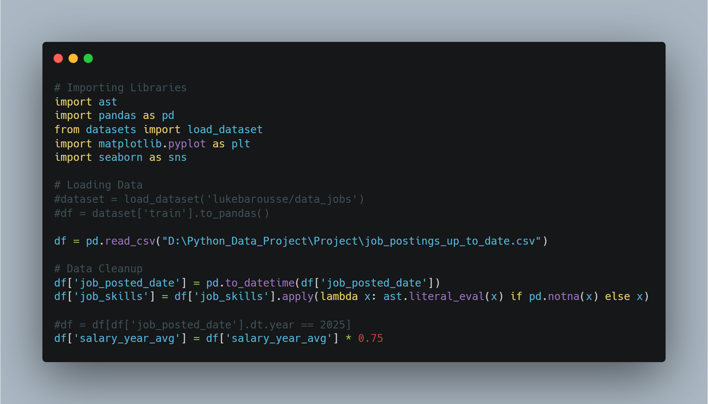

*Due to the salaries intially being in $USD, I run a conversion using the conversion rate as of 06/07/2025*

# The Analysis

## 1. What are the most in-demand skills for the roles investigated?

To begin the analysis, I identified the **five most in-demand skills** for each of the three roles investigated within the UK job market. Comparing these skills provides insight into the core technologies and competencies employers prioritise, while also highlighting the similarities and differences between each profession.

View my notebook with the detailed steps on this here: [Skills_count.ipynb](Project/Skills_count.ipynb)

### Results

*Bar graph visualising the salary for data analyst, data scientist and machine learning engineer roles and their top 5 skills associated with each*

### Insights

- SQL is a core skill across all three roles, ranking as the most in-demand skill for both Data Analysts and Data Engineers, and the second most in-demand skill for Data Scientists.

- Python is consistently one of the most sought-after skills, appearing in over 30% of Data Analyst postings and more than 50% of both Data Scientist and Data Engineer postings. It is the single most requested skill for Data Scientists.

- Data Analyst roles place greater emphasis on business intelligence and data visualisation tools, with Excel, Power BI, and Tableau featuring prominently. In contrast, Data Scientists and Data Engineers rely more heavily on programming languages and cloud technologies, particularly Python, SQL, Azure, and AWS.

- Data Scientists and Data Engineers share a much more similar technical skill set than either does with Data Analysts. Four of their top five skills (Python, SQL, Azure, and AWS) overlap, whereas Data Analysts uniquely prioritise business intelligence tools.

## 2. How are in-demand skills trending over time?

To investigate how demand for key skills has changed over time, I separated the dataset into three DataFrames, one for each role. I then analysed the five most in-demand skills for each role on a quarterly basis from the beginning of 2023 to the end of 2025. This allows changes in employer demand to be tracked and highlights emerging or declining technologies.

View my notebook with the detailed steps on this here: [skills_distribution.ipynb](Project/skills_distribution.ipynb)

## 2.1 Data Analysts

### Results

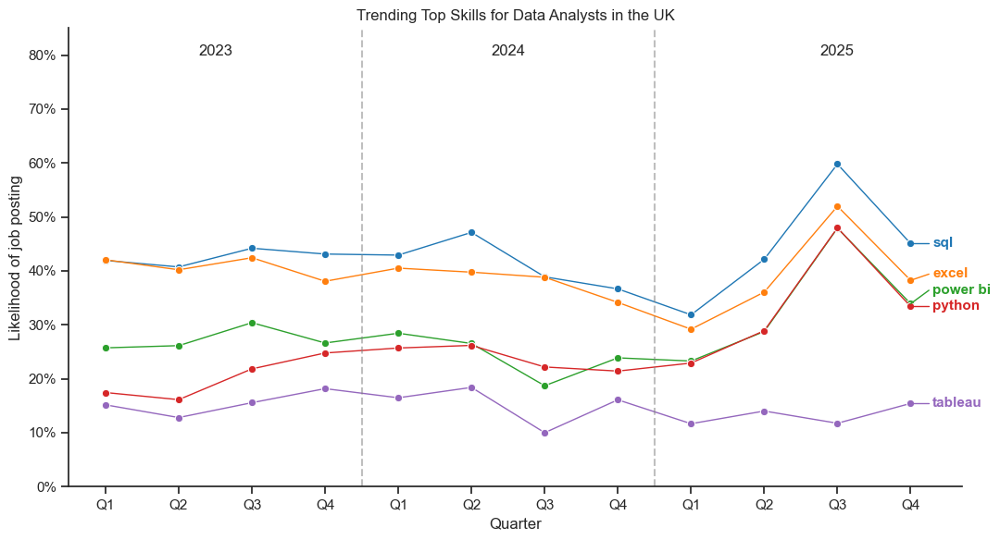

*Line graph visualising the trending top skills for data analysts in the UK from 2023 to 2025*

### Insights

- Apart from Tableau, the four most requested skills all declined in demand from Q2 2024 until Q1 2025, before rising sharply to a peak in Q3 2025. 

- SQL is consistently the most in-demand skill for UK Data Analysts, appearing in the highest proportion of job postings in every quarter analysed.

- Python exhibits the strongest long-term growth in demand. Aside from the broad decline observed between Q3 and Q4 2025 across several skills, Python's demand remains comparatively stable from quarter to quarter.

- Through 2023 and 2024, Excel showed a gradual decline in demand. Although demand recovered during 2025, the gap between Excel and emerging tools such as Python and Power BI narrowed considerably over the three-year period.

- Tableau doesn't exhibit the same cyclical behaviour as our other skills. It's demand remains stable and it doesn't experience the pronounced Q3 2025 spike seen with other skills.

## 2.2 Data Scientists

### Results

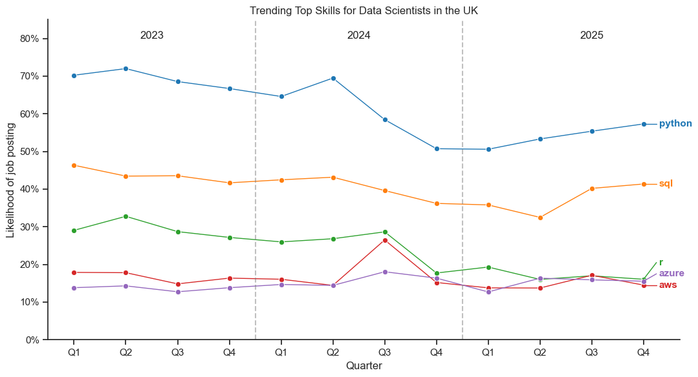

*Line graph visualising the trending top skills for data scientists in the UK from 2023 to 2025*

### Insights

- Python, SQL and R all generally declined in demand throughout 2023 and 2024. Python experienced its largest drop in Q3 2024, while R during Q4 2024.

- Python remained by far the most in-demand skill, appearing in over 50% of postings across all 12 quarters. Although demand never returned to its peak of ≈ 70%, it displayed steady growth throughout 2025, ending at nearly 60% in Q4.

- SQL showed a more gradual decline than Python and appeared in over 40% of job postings during eight of the twelve quarters analysed. The gap between Python and SQL narrowed from approximately 24 percentage points in Q1 2023 to around 16–18 percentage points by Q4 2025.

- R exhibited a gradual downward trend throughout the three-year period. Unlike Python and SQL, which recovered during 2025, R continued to decline and ended only marginally ahead of Azure, suggesting that Azure may become more prevalent if these trends continue.

- Azure was the only one of the five skills to finish 2025 above its Q1 2023 level. Both Azure and AWS both displayed the most stable figures of the five skills.

## 2.3 Machine Learning Engineers

### Results

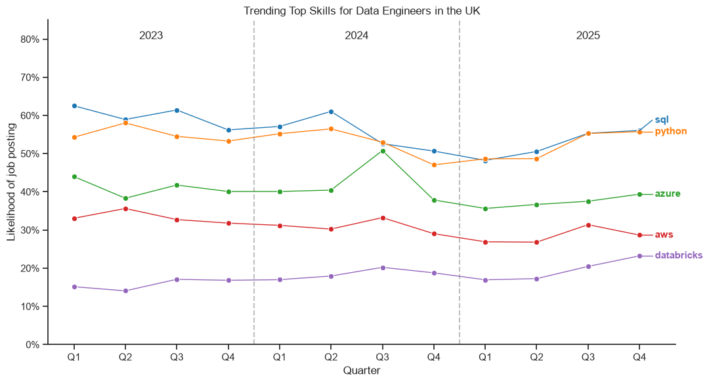

*Line graph visualising the trending top skills for data engineers in the UK across from 2023 to 2025*

### Insights

- The ranking of the five most in-demand skills remains highly consistent throughout the three-year period. SQL and Python dominate demand in every quarter, only briefly exchanging first place during Q3 2024 and Q2 2025. Neither skill establishes a sustained lead over the other.

- Databricks shows the clearest long-term increase, rising from roughly 15% of postings in early 2023 to around 23% by the end of 2025. Although still the least requested of the five skills, its demand increases gradually over the period.

-Overall, the required technical skill set for Data Engineers remains remarkably stable over the three-year period, suggesting that employer demand for the core technologies associated with the role changed relatively little between 2023 and 2025.

## 3. How well do our three roles pay?

To compare the salary distributions of the three selected job roles, box plots were used. Box plots provide a clear visual summary of the median salary, interquartile range (IQR), and any potential outliers, making them well suited for comparing salary distributions across multiple groups.

Before constructing the plots, rows containing missing values (NaN) in the salary_year_avg column were removed. Since these entries do not contain salary information, including them would not contribute to the analysis and could affect the accuracy of the results.

View my notebook with the detailed steps on this here: [job_salaries.ipynb](Project/job_salaries.ipynb)

### Results

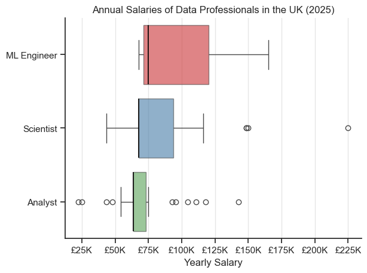

*Box plots visualising the salaries for our three job roles*

### Insights

- Data Engineers recorded the highest median salary, approximately £38k higher than that of Data Scientists. The role also exhibited several outliers exceeding £200k, suggesting that senior or highly specialised positions can command substantially higher salaries than the typical advertised role.

- Data Scientists and Data Analysts shared identical lower quartile and median salaries, indicating that a large proportion of advertised salaries were concentrated at the lower end of their respective salary distributions.

- Data Analysts exhibited the narrowest interquartile range (IQR), implying that the middle 50% of advertised salaries were more consistent than those of the other two occupations.

- All three roles contain high-salary outliers, although these are considerably more pronounced for Data Engineers. This suggests that exceptional salaries are possible across the data profession, but are more common in engineering-focused roles.

## 4. What are the most optimal skills and technologies to learn for data roles?

To identify the most optimal skills to learn, I identified both the percentage of postings that contained my skills, as well as the median salary for these and plotted them on a scatter graph. I also colour coded the technologies in order to visualise how these distributed.

*note that only skills that featured in more than 7% of postings were included in the results*

View my notebook with the detailed steps on this here: [optimal_skills.ipynb](Project/optimal_skills.ipynb)

## 4.1.1 Data Analysts - Optimal Skills

### Results

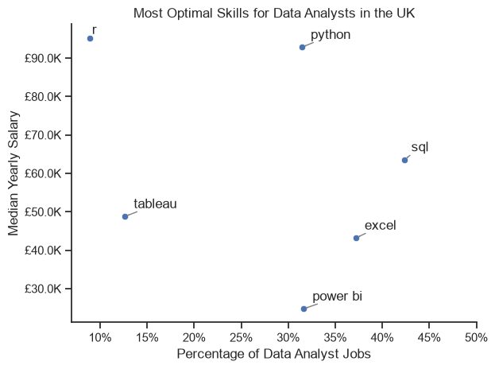

*Scatter plot illustrating the relationship between median annual salary and the percentage of UK Data Analyst job postings requiring each skill*

### Insights

- R is associated with the highest median salary, despite appearing in only ≈8% of job postings. This suggests that more specialised skills may command a salary premium.

- Python stands out by combining both a high median salary and strong demand, making it one of the most valuable skills for aspiring data analysts in terms of both employability and earning potential.

- Tableau and Excel feature prominently across job postings but are associated with lower median salaries than Python, SQL, and R. This may be because they are widely expected baseline business intelligence tools, whereas programming and statistical languages are often required for more technically demanding, and therefore higher-paying, roles.

## 4.1.2 Data Analysts - The technologies

### Results

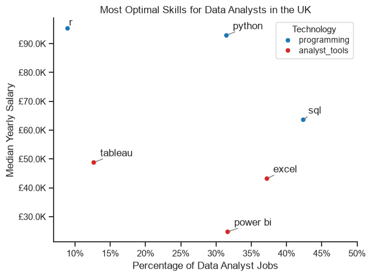

*A coloured scatter plot visualising the technologies of our skills*

### Insights

- Programming languages are consistently associated with higher median salaries than analyst tools, suggesting that stronger programming skills may command a salary premium due to their greater technical complexity and broader application.

- Cloud platforms and machine learning libraries do not appear among the most in-demand skills, each featuring in less than 7% of job postings. This may reflect the fact that these technologies are more commonly associated with specialised roles, such as Data Scientists or Data Engineers, rather than Data Analyst positions.

## 4.2.1 Data Scientists - Optimal Skills

### Results

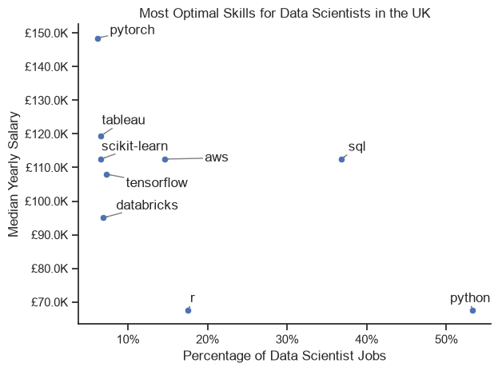

*Scatter plot illustrating the relationship between median annual salary and the percentage of UK Data Scientist job postings requiring each skill*

### Insights

- Most of the highest-paying skills appear in fewer than 10% of job postings, reinforcing the trend observed for Data Analysts that more specialised skills may command a salary premium.

- Python is by far the most in-demand skill, featuring in over half of all postings, yet it is associated with one of the lowest median salaries among the top skills. This may be because Python has become a fundamental requirement for many Data Scientist roles, whereas more specialised technologies, such as PyTorch, AWS, and Scikit-learn, are often required for higher-paying positions.

- SQL offers the strongest balance between salary and demand, combining a high median salary (≈£113k) with demand in almost 40% of job postings. This suggests it remains one of the most valuable skills for aspiring Data Scientists.

## 4.2.2 Data Scientists - The technologies

### Results

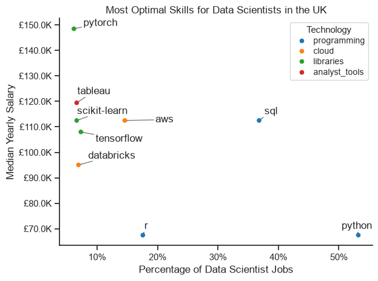

*A coloured scatter plot visualising the technologies of our skills*

### Insights

- Machine learning libraries appear to command a salary premium, with PyTorch, Scikit-learn, and TensorFlow all associated with median salaries exceeding £100k despite appearing in relatively few job postings. This suggests that expertise in specialised machine learning frameworks is highly valued.

- Programming languages appear to offer a weaker salary premium than expected. While Python and R are among the most recognisable Data Science skills, both are associated with comparatively low median salaries. This may be because they are considered foundational requirements across many Data Scientist roles rather than specialist differentiators.

-Cloud technologies exhibit mixed outcomes. AWS is associated with a high median salary, whereas Databricks commands a noticeably lower median despite both appearing in relatively few job postings. This suggests that not all cloud technologies carry the same salary premium.

## 4.3.1 Data Engineers - Optimal Skills

### Results

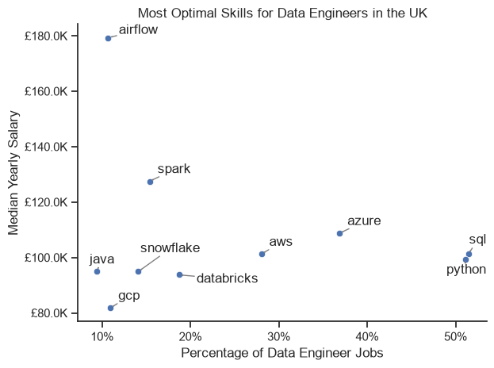

*Scatter plot illustrating the relationship between median annual salary and the percentage of UK Data Engineer job postings requiring each skill*

### Insights

- SQL and Python provide the strongest combination of high demand and competitive salaries, featuring in over 50% of Data Engineer job postings while both commanding median salaries of approximately £100k. This suggests they are foundational skills with strong market value.

- Apache Airflow commands the highest median salary (≈£180k) despite appearing in only around 10% of job postings, reinforcing the trend observed in previous roles that highly specialised technologies can attract a substantial salary premium.

- Cloud and big data technologies, such as AWS, Azure, Spark, and Snowflake, are all associated with median salaries of £100k or more while appearing in a moderate proportion of job postings. This highlights the importance of cloud computing and distributed data processing skills for higher-paying Data Engineering roles.

## 4.3.2 Data Engineers - The technologies

### Results

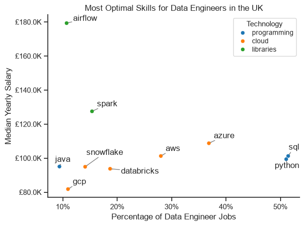

*A coloured scatter plot visualising the technologies of our skills*

### Insights

- Library technologies command the highest salaries overall. Both Airflow and Spark are associated with substantially higher median salaries than the other technology categories, suggesting that expertise in data orchestration and distributed processing is particularly valuable for Data Engineering roles.

- Cloud technologies exhibit a more consistent relationship between demand and salary. As demand increases from GCP to AWS and Azure, median salaries also increase, indicating that widely adopted cloud platforms are associated with stronger earning potential.

- Programming languages appear to be the most commonly requested technologies, with Python and SQL featuring in over 50% of job postings. However, despite their widespread demand, they command lower median salaries than specialised library technologies, suggesting they are expected baseline skills rather than differentiating expertise.

## 5. What I Learned

Completing this project allowed me to deepen my understanding of the Python libraries most commonly used in data analysis, namely Pandas, Matplotlib, and Seaborn. It also gave me a clearer understanding of the UK job market for the data roles I investigated, including the technologies and skills most valued by employers. Some of the specific thing I learnt included:

- **Sample Size** - The size of a dataset should always be considered when interpreting results. Smaller sample sizes can produce misleading trends or exaggerate the significance of certain findings, so conclusions should be drawn with appropriate caution.

- **Data Cleaning** - Thoroughly cleaning and preprocessing data before analysis leads to more reliable results and simplifies later stages of the project. Handling missing values, inconsistent formats, and irrelevant data early on made the analysis more efficient and reduced the likelihood of errors.

- **Suitable visualisation** - Choosing an appropriate visualisation is essential for communicating insights effectively. Careful consideration of chart types, colour schemes, labels, and annotations made the results clearer and easier to interpret for the reader.

## Insights

Investigating these roles revealed several key insights, including:

- Python and SQL featured prominently across all three roles, highlighting both their importance as core technical skills and their transferability across different areas of data.

- Although Python and SQL were consistently in demand, the technologies prioritised by each role differed considerably:

    - Data Analysts placed greater emphasis on business intelligence and visualisation tools, particularly Excel, Power BI, and Tableau.
    - Data Scientists relied more heavily on programming languages and machine learning libraries, with technologies such as Python, SQL, R, PyTorch, and Scikit-learn featuring prominently.
    - Data Engineers showed a much stronger emphasis on cloud platforms and data engineering technologies, with AWS, Azure, and Airflow among the most sought-after skills.
- Skills associated with higher salaries generally appeared in fewer job postings, suggesting that more specialised skills command a salary premium.

## Challenges

This project presented several key challenges, including:

- **Limited Sample Sizes** – Some technologies appeared in relatively few job postings, requiring careful consideration of whether there was sufficient data to draw meaningful conclusions.

- **Choosing Appropriate Visualisations** – Selecting the most effective chart for each analysis required careful thought to ensure trends and comparisons were communicated clearly and accurately.

- **Interpreting Results** – Drawing meaningful insights from the data while avoiding unsupported conclusions was one of the most challenging aspects of the project. It was important to ensure that any explanations remained consistent with the evidence presented by the data.

## Conclusion

This project highlighted the importance of keeping up with the continually evolving skill requirements across data-related roles. It provided valuable insight into the core technologies and skills sought by employers in the UK, while demonstrating how these differ between Data Analyst, Data Scientist, and Data Engineer positions. Overall, I believe this project offers a comprehensive analysis of the UK data job market and provides a useful foundation for future investigation into trends within the field.

